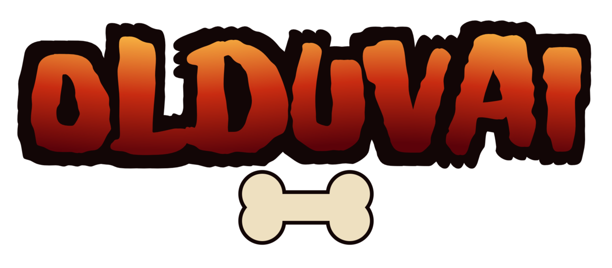

# Olduvai

<p align="center"></p>

<p align="center"><a href="https://github.com/ksokolowski/olduvai/actions/workflows/ci.yml"></a> <a href="https://github.com/ksokolowski/olduvai/releases/latest"></a> <a href="https://github.com/sponsors/ksokolowski"></a> <a href="https://ko-fi.com/styledconsole"></a></p>

**Prehistorik** (Titus Interactive, 1991) is the DOS platformer many of us
grew up with: a club-swinging caveman braving dinosaurs, ice and volcanoes
to fill his tribe's larder. Thirty-five years on, the floppies are fading
and the machines that ran them are museum pieces — but the game is too good
to be left behind.

Olduvai exists to preserve it and keep it playable: a native C++/SDL2
recreation of the Prehistorik engine for modern platforms — macOS
(Apple Silicon), desktop Linux, and Windows, with retro handhelds planned.
Faithful to the DOS original down to its quirks for the players who
remember feeding that caveman the first time around — and, when you want
it, widescreen, HD and gamepad-ready for a generation meeting him for the
first time.

(No gameplay screenshots here, deliberately: this repository and its
releases contain **zero game-derived content**, imagery included —
CI-enforced; see [LEGAL.md](LEGAL.md). Bring your own copy and it looks
just like 1991.)

Olduvai is an engine only — it ships no game content. You bring your own
copy of the game: see [Getting the game](#getting-the-game) and
[LEGAL.md](LEGAL.md).

## Status

**Beta — 0.9.2.** The full game is playable natively: all seven levels,
the three boss fights, caves, secret rooms, flight sequences and the
ending. Behaviour is validated frame-by-frame against an independent
reference implementation — a 12-scenario cross-engine corpus plus a
300-frame golden trace run in CI, with both engines in shared-RNG
lockstep, zero tolerance.

## Features

**Faithful by default.** The `dos` profile reproduces the DOS original —
including its bugs — at the exact PIT tick rate (18.2065 Hz, absolute-
deadline scheduler), with a VGA-style hold-frame scanout for CRT-smooth
presentation and whole-pixel integer scaling in fullscreen. Known,
deliberate deviations are individually documented.

**Enhanced when you want it.** The `hd` profile (and granular
`--enhance` flags) adds: HD sprite upscaling (OmniScale, xBR, MMPX,
Eagle, smooth, retro), true widescreen with live level margins and
panorama transitions, smooth 60 FPS motion interpolation, vector text
and enhanced HUD, and a set of hand-crafted animation extensions
(cave descent/emerge sequences, teleport clouds, descent dust, and
more). `hd-43` keeps the enhanced pipeline at the classic 4:3 aspect.

**Audio.** OPL/AdLib FM synthesis is built in — an EXE-faithful AdLib
driver on the vendored Nuked-OPL3 core, with no external dependency.
Roland MT-32 (libmt32emu — needs your own ROM images) and
General MIDI (FluidSynth + SoundFont) load at runtime, plus host MIDI
out for real hardware. Data-driven sound effects follow the selected
backend.

**In-game menus.** Title menu with direct level select on Start Game
(left/right), a one-click Style preset (Classic DOS / Enhanced HD) in
Options, pause menu with live-apply settings, quicksave/load, cheats,
and a boss-fight pause — all driven by a declarative menu model shared
with the reference engine.

**Tooling.** F5 in-game bug capture with an annotation form (tag /
reproducibility / multi-line description, edited in a native text field);
reports land in `~/olduvai/bug_reports` (override with the `bug_report_dir`
key in `play.json` or `$OLDUVAI_BUG_DIR`).  Plus input record/replay,
draw-call logging, debug overlays (collision/entities/perf), god mode, and
headless screenshot hooks.

## Getting the game

Olduvai reads the original data files from your own copy of the game:

- **GOG (recommended):**
  [*Prehistorik 1+2*](https://www.gog.com/game/prehistorik_12) — supported
  out of the box. The engine reads the `PREH.SQZ` container the GOG release
  ships and auto-discovers a GOG installation, so a plain `--play` typically
  just works.
- **Original floppies / DOS files:** if a dusty box in the attic still holds
  your 1991 diskettes — or a backup of them — those files work directly:
  `FILESA.CUR`, `FILESB.CUR`, `FILESA.VGA`, `FILESB.VGA`, `HISTORIK.EXE`.
  Point `--game-dir` at wherever they live.

On first run the engine prepares everything it needs into a local cache on
your machine; your original files are never modified.

## Downloads

Prebuilt engine binaries for each release are on the
[Releases page](../../releases/latest):

| Platform | File |
|---|---|
| Linux x86_64 (any distro) | `olduvai-<version>-linux-x86_64.AppImage` |
| Windows x86_64 (portable) | `olduvai-<version>-windows-x86_64.zip` |
| macOS (universal: Apple Silicon + Intel) | `olduvai-<version>-macos-universal.dmg` |

Binaries are **not code-signed** (a hobby project without paid developer
accounts):

- **macOS:** first launch — right-click `Olduvai.app` → *Open* → *Open*.
  On macOS 15+ the dialog has no Open button: try to open the app once,
  then allow it under *System Settings → Privacy & Security → Open Anyway*.
  If Gatekeeper still refuses: `xattr -cr /Applications/Olduvai.app`.
- **Windows:** if SmartScreen shows "Windows protected your PC", click
  *More info* → *Run anyway*.
- **Linux:** `chmod +x olduvai-*.AppImage`, then run it.

Verify a download against the release's `SHA256SUMS.txt`:
`shasum -a 256 -c SHA256SUMS.txt --ignore-missing`.

## Running

```sh
# Faithful DOS experience
./build/release/olduvai --game-dir /path/to/your/prehistorik/files --profile dos --play

# Full enhanced experience (widescreen HD)
./build/release/olduvai --game-dir /path/to/your/prehistorik/files --profile hd --play

# Jump straight into a level (1-7 by in-game numbering; 0 = intro, 8 = ending)
./build/release/olduvai --game-dir ... --profile hd --play --level 3
```

Launched from a terminal without game files, Olduvai reports what is
missing and exits; launched from the GUI (double-click), it opens a dialog
instead — locate your game folder (remembered from then on) or jump to the
GOG store page, then choose Classic or Enhanced HD once (changeable any
time under Options → Style). ALT+ENTER toggles fullscreen; ESC opens the pause menu.

**Gamepad:** any SDL2-recognised controller works out of the box, with
hotplug. Defaults: d-pad / left stick to move, **A** jump (and confirm in
menus), **X** attack, **Start** / **B** pause / back. Remap via the
`pad_*` settings keys below.

## Building

```sh
cmake --preset release && cmake --build --preset release   # → build/release/olduvai
```

Requires CMake ≥ 3.21, a C++17 compiler and SDL2. Per-platform
instructions, packaging (AppImage / dmg / Windows zip), the test suite and
all build options: [docs/BUILDING.md](docs/BUILDING.md).

## Settings

Settings live in `~/.config/olduvai/play.json` (flat JSON; profile beats
saved config, CLI flags beat both; `--save-config` persists the current
flags). Common keys: `game_dir`, `music_device` (`auto`, `opl`,
`mt32-builtin`, `gm-builtin`, `host-midi`, `gm-host`, `none`), `rom_dir`,
`soundfont`, `sfx_backend`, `hd_profile`, `render_scale`, `aspect` (`keep`,
`4:3`, `stretch`, `widescreen`), `vga_scan`, `fullscreen`, per-feature `enhance.*`
toggles, and gamepad mapping: `pad_jump`, `pad_attack`, `pad_pause`,
`pad_confirm`, `pad_back` (SDL button names — `a`, `b`, `x`, `y`,
`start`, `back`, `leftshoulder`, …) plus `pad_deadzone` (default 8000). Built-in profiles: `dos` (byte-faithful), `hd` (enhanced
widescreen), `hd-43` (enhanced at 4:3).

## How it was built

The engine is the product of an evidence-driven reverse-engineering
pipeline: multi-tool triangulation of the original DOS executable
(Ghidra, Reko, Rizin, with Capstone byte-level arbitration and raw-byte
verification), a Findings knowledge base, an executable Python
reference implementation proven first, then mapped here with both
engines validated in cross-engine lockstep. The full method is
described in [docs/METHOD.md](docs/METHOD.md).

## Acknowledgements

- **Titus Interactive** created Prehistorik in 1991 — the game this whole
  project is a love letter to. Buy and own the original.
- Built with [SDL2](https://libsdl.org),
  [Nuked-OPL3](https://github.com/nukeykt/Nuked-OPL3) (OPL/AdLib synthesis),
  [munt / libmt32emu](https://github.com/munt/munt) (MT-32 emulation),
  [FluidSynth](https://www.fluidsynth.org) (General MIDI), and
  [stb](https://github.com/nothings/stb) (PNG output).

## Supporting the project

Olduvai is a hobby project, free software, and will stay that way. If it
brought your caveman back to life and you'd like to support the engine's
continued development:

| Platform        | Link                                                                       |
| --------------- | -------------------------------------------------------------------------- |
| GitHub Sponsors | [github.com/sponsors/ksokolowski](https://github.com/sponsors/ksokolowski) |
| Ko-fi           | [ko-fi.com/styledconsole](https://ko-fi.com/styledconsole)                 |

(Sponsoring supports the development of this open-source engine; it does
not buy the game — you still [bring your own copy](#getting-the-game).)

**First funding goal — signed binaries:** an Apple Developer membership
(~$99/yr) so the macOS build installs without the Gatekeeper workarounds,
plus code-signing for the Windows build. Everything so far has been built
on personal time and money; this is the first thing sponsorship would buy.

## Legal

The short version — the complete position is in [LEGAL.md](LEGAL.md):

- Olduvai is an **independent, from-scratch reimplementation**. It contains
  no code or data from the original game, and never will (CI-enforced).
- **You need your own copy of the game**; the engine reads it locally and
  never redistributes it.
- Prehistorik © 1991 Titus Interactive; all marks belong to their respective
  owners. This project is not affiliated with or endorsed by any rights
  holder of the original game.
- "Olduvai"™, the bone logo and the fire-styled wordmark are this project's
  marks — forks must use a different name.

## License

GPL-3.0-or-later — see [LICENSE](LICENSE). Third-party components and their
licenses: [THIRD-PARTY-NOTICES.md](THIRD-PARTY-NOTICES.md) (release binaries
carry the same texts in `licenses/`).
