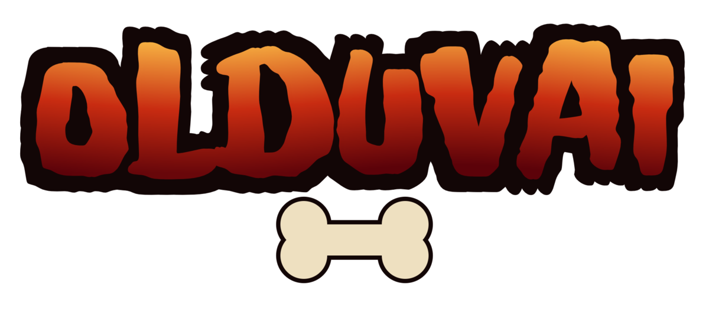
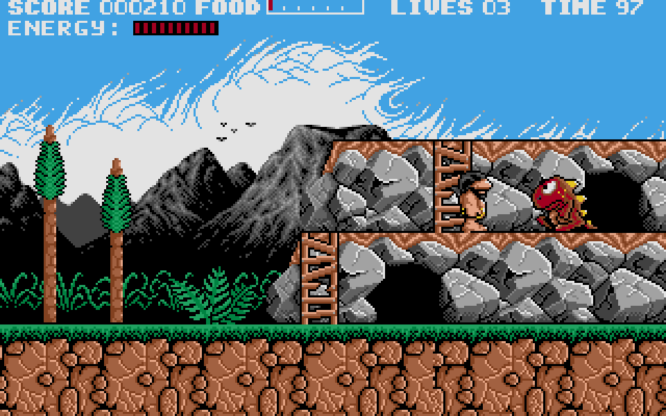
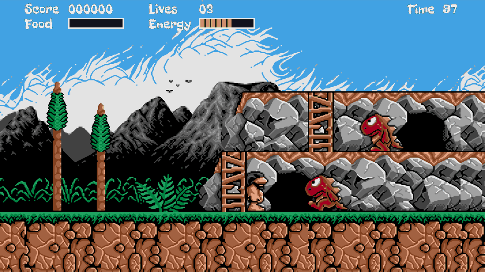

# Olduvai

<p align="center"></p>

<p align="center"><a href="https://github.com/ksokolowski/olduvai/actions/workflows/ci.yml"></a> <a href="https://github.com/ksokolowski/olduvai/releases/latest"></a> <a href="https://github.com/ksokolowski/olduvai/releases"></a> <a href="https://github.com/sponsors/ksokolowski"></a> <a href="https://ko-fi.com/styledconsole"></a></p>

Remember **Prehistorik**? 1991: a caveman with a club, a tribe waiting for
dinner, and a world of dinosaurs, frozen lakes and volcanoes standing
between him and the food.  If you played it as a kid on a 386 with a Sound
Blaster, it is back, and it plays exactly the way you remember.  If you
missed it, or were not around yet in 1991, this is a good time to meet a
proper 90s platformer: tough, funny, with a few secrets and a lot of caves
to crawl into, and not in the mood to explain itself.

**Olduvai** is a new engine for that game, running natively on macOS, Linux,
Windows and Linux handhelds.  Play it as it was, pixel for pixel and bug for
bug, or switch on widescreen, HD graphics and smooth motion and see the old
levels as they never looked before.

You bring the game files ([GOG sells them](#getting-the-game)); Olduvai does
the rest.  No game data ships here, and CI makes sure it stays that way
([LEGAL.md](LEGAL.md)).

## Status

**Release candidate: 0.9.10.**  The whole game plays, on the desktop and on
handhelds: seven levels, three boss fights, caves, secret rooms, the balloon
flights and the ending.  No known bugs.  Every frame is checked against an
independent reference implementation, in lockstep, with zero tolerance.

What stands between this and 1.0.0 is you playing it.  If anything plays
differently from 1991, that is a bug: [open an
issue](https://github.com/ksokolowski/olduvai/issues).  F5 in the game saves
a report with a screenshot you can attach.

For the curious, the code is held to the same standard as the play.  Every
change passes a complexity ratchet and whole-tree static analysis, coverage is
measured per layer, and no cleanup may move a single frame.  Start at
[docs/ARCHITECTURE.md](docs/ARCHITECTURE.md).

## Screenshots

<table>
<tr>
<td align="center"><b>Classic DOS</b> — as it was in 1991</td>
<td align="center"><b>Enhanced HD</b> — widescreen, smooth motion, vector HUD</td>
</tr>
<tr>
<td></td>
<td></td>
</tr>
</table>

Frames of this engine running a legitimately owned copy of the game (see
[assets/screenshots](assets/screenshots/README.md)).

## Features

Two ways to play, one switch apart (*Options → Style*):

- **Classic DOS**: the 1991 game, its quirks included, at the original timer
  rate, with a VGA-style scanout and whole-pixel scaling.
- **Enhanced HD**: sharp HD upscaling, real widescreen (the side margins show
  the neighbouring screens instead of black bars), smooth 60 FPS motion, a
  vector HUD, and a few new touches, like balloons that drift away when a
  ride ends.

The sound of 1991 comes with it.  Pick the card you had: Sound Blaster or
AdLib are built in, the Roland MT-32 is emulated if you have its ROMs,
General MIDI works with a SoundFont ([docs/AUDIO.md](docs/AUDIO.md)).

Also in the box: any SDL2 gamepad (Xbox and Nintendo layouts), level select,
quicksave, cheats for the hard bits, and F5 bug reports from anywhere in the
game.

## Getting the game

- **GOG (recommended):** [*Prehistorik 1+2*](https://www.gog.com/game/prehistorik_12)
  works out of the box.  Olduvai finds the installation and reads its
  `PREH.SQZ` directly.
- **Your original floppies:** `FILESA.CUR`, `FILESB.CUR`, `FILESA.VGA`,
  `FILESB.VGA` and `HISTORIK.EXE`.  Point `--game-dir` at them.

Your files are only read, never modified.

## Downloads

On the [Releases page](../../releases/latest):

| Platform | File |
|---|---|
| Linux x86_64 (any distro) | `olduvai-<version>-linux-x86_64.AppImage` |
| Windows x86_64 (portable) | `olduvai-<version>-windows-x86_64.zip` |
| macOS (universal) | `olduvai-<version>-macos-universal.dmg` |
| TrimUI Smart Pro (KNULLI) | `olduvai-<version>-knulli-trimui.zip` |
| Powkiddy A12 (KNULLI) | `olduvai-<version>-knulli-a12.zip` |
| Other handhelds (PortMaster) | `olduvai-<version>-portmaster.zip` |

**Handhelds:** Enhanced HD runs on the TrimUI Smart Pro close to full speed.
Install steps, controls and music: [docs/HANDHELD.md](docs/HANDHELD.md).  The
**[PortMaster](https://portmaster.games/)** package reaches many more devices
and firmwares, 64-bit and 32-bit ARM alike; it has been played on the TrimUI
Smart Pro and the Powkiddy A12 (KNULLI) and on a 640x480 R36S clone (ArkOS).

The binaries are not code-signed yet (see [the first funding
goal](#supporting-the-project)):

- **macOS:** right-click `Olduvai.app` → *Open* → *Open*; on macOS 15+,
  allow it under *System Settings → Privacy & Security → Open Anyway*;
  if Gatekeeper still refuses, `xattr -cr /Applications/Olduvai.app`.
- **Windows:** SmartScreen → *More info* → *Run anyway*.
- **Linux:** `chmod +x olduvai-*.AppImage`.

Verify a download: `shasum -a 256 -c SHA256SUMS.txt --ignore-missing`.

## Playing

Double-click to play.  If Olduvai cannot find the game it asks for the
folder once, then for Classic or Enhanced.  From a terminal:

```sh
olduvai --game-dir /path/to/game --profile dos --play   # the 1991 game
olduvai --game-dir /path/to/game --profile hd --play    # Enhanced HD
olduvai --game-dir /path/to/game --play --level 3       # straight to a level
```

ESC opens the pause menu, ALT+ENTER toggles fullscreen.  A pad works out of
the box; *Options → Controls* remaps it.  Everything the settings file can
hold: [docs/SETTINGS.md](docs/SETTINGS.md).

## Building

```sh
cmake --preset release && cmake --build --preset release   # → build/release/olduvai
```

CMake ≥ 3.21, a C++17 compiler, SDL2 ≥ 2.0.20.  Platforms, packaging and the
test suite: [docs/BUILDING.md](docs/BUILDING.md).

## How it was built

Evidence first.  The DOS executable was read with several disassemblers and
checked byte by byte, every finding went into a knowledge base, a reference
implementation proved each behaviour, and this engine is held to that
reference frame by frame.  The full story: [docs/METHOD.md](docs/METHOD.md).

## Supporting the project

Olduvai is a hobby project and free software, and will stay that way.  If it
brought your caveman back to life:

| Platform        | Link                                                                       |
| --------------- | -------------------------------------------------------------------------- |
| GitHub Sponsors | [github.com/sponsors/ksokolowski](https://github.com/sponsors/ksokolowski) |
| Ko-fi           | [ko-fi.com/styledconsole](https://ko-fi.com/styledconsole)                 |

Sponsoring supports the engine; it does not buy the game.  What it would buy,
in order:

1. **Signed binaries.** An Apple Developer membership (~$99/yr) and Windows
   code-signing, so installing needs no workarounds.
2. **Modern handhelds.** Newer devices to port to and test on, Android-based
   ones in particular, on the way to an Android port.

Everything so far has been built on personal time and money.

## Thank you, Titus

Prehistorik was made by **Titus Interactive** in 1991.  I was one of the
kids who played it back then, and this engine is my thank-you to the people
who made it.  If Olduvai brings back a good memory, buy the original on GOG
and keep their work alive.

Olduvai stands on [SDL2](https://libsdl.org),
[Nuked-OPL3](https://github.com/nukeykt/Nuked-OPL3),
[munt / libmt32emu](https://github.com/munt/munt),
[FluidSynth](https://www.fluidsynth.org) and
[stb](https://github.com/nothings/stb).  Thanks to their authors too.

## Author and upstream

Olduvai is written and maintained by Krzysztof Sokołowski
([@ksokolowski](https://github.com/ksokolowski)), who holds the copyright.
This repository is the upstream: the source, every release and each package
(the AppImage, the macOS disk image, the Windows zip and the handheld bundles)
are made and published from here by the author.  A copy under the Olduvai name
that does not point back to this repository is not the author's; the name and
marks are covered in [LEGAL.md](LEGAL.md).

## Legal

The complete position is in [LEGAL.md](LEGAL.md); in short:

- An **independent, from-scratch reimplementation**.  It contains no code or
  data from the original game (CI-enforced), apart from a few curated,
  silent frames of this engine's own output.
- **You need your own copy of the game**; it is read locally, never
  redistributed.
- Prehistorik © 1991 Titus Interactive; all marks belong to their owners.
  Not affiliated with or endorsed by any rights holder.
- "Olduvai"™, the bone logo and the wordmark are this project's marks;
  forks must use a different name.

## License

GPL-3.0-or-later: [LICENSE](LICENSE).  Third-party components:
[THIRD-PARTY-NOTICES.md](THIRD-PARTY-NOTICES.md) (release binaries carry the
texts in `licenses/`).
